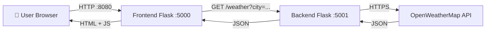
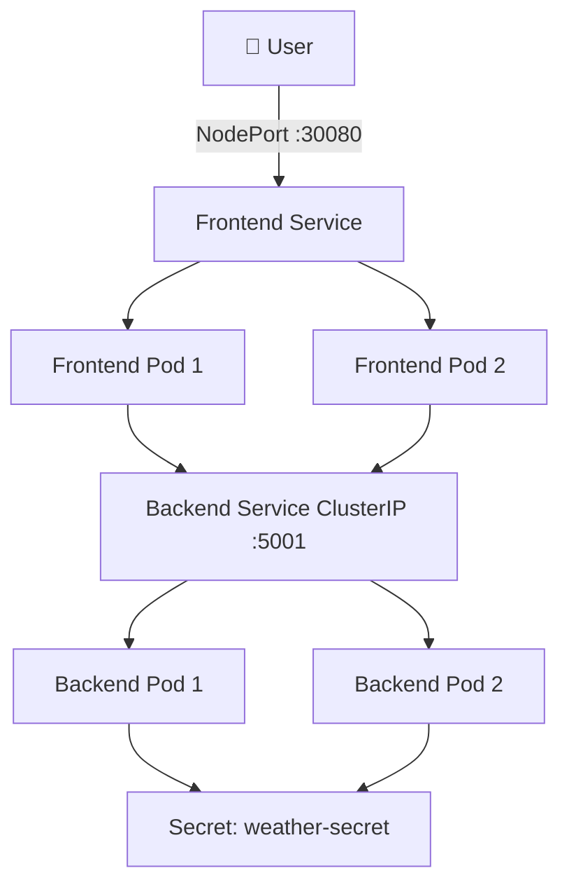

# Weather Broadcasting App

A simple two-tier weather application that fetches real-time weather data from OpenWeatherMap and displays it in a clean web interface. Built with Python (Flask), Docker, Docker Compose, Kubernetes, and optionally exposed via ngrok.

---

## 📌 Project Idea

The app allows users to enter a city name and get current weather information (temperature, humidity, description, etc.). It follows a **two-tier architecture**:

- **Frontend**: A Flask web server serving an HTML page. It receives user input and calls the backend API.
- **Backend**: A Flask REST API that calls the OpenWeatherMap API and returns JSON data.

This separation makes it easy to scale, develop, and deploy each tier independently.

---

## 🏗️ Architecture & Workflow

### High-Level Workflow



### Kubernetes Deployment (Minikube)



---

<<<<<<< HEAD
## 🧰 Tech Stack

- **Backend**: Python 3.9, Flask, Requests
- **Frontend**: Python 3.9, Flask, HTML/CSS/JavaScript
- **Containerization**: Docker, Docker Compose
- **Orchestration**: Kubernetes (Minikube)
- **External API**: OpenWeatherMap
- **Tunneling (optional)**: ngrok

---

## 📁 Project Structure

```
=======
>>>>>>> 882357cd19d00fb9c0676202c1e5060f733105ce
weather-app/
├── .env                      # API key (never commit this!)
├── docker-compose.yml
├── backend/
│   ├── app.py
│   ├── requirements.txt
│   └── Dockerfile
├── frontend/
│   ├── app.py
│   ├── requirements.txt
│   ├── Dockerfile
│   └── templates/
│       └── index.html
└── k8s/
    ├── weather-secret.yaml
    ├── backend-full.yaml
    └── frontend-full.yaml
```

---

## 🔌 Port Mapping

| Service | Local (Docker Compose) | Kubernetes (Minikube) |
| :--- | :--- | :--- |
| **Frontend** | `8080:5000` (host:container) | NodePort `30080` → targetPort `5000` |
| **Backend** | `5001:5001` | ClusterIP `5001` (internal only) |

- **Frontend** runs on port `5000` inside the container.
- **Backend** runs on port `5001` inside the container.
- When using Docker Compose, you access the app at `http://localhost:8080`.
- In Kubernetes, you access it via `minikube service frontend-service` or `http://<minikube-ip>:30080`.

---

## 🌐 Ngrok Setup (Optional)

ngrok creates a secure tunnel from the public internet to your local machine. This is useful for demoing your app without deploying to a cloud provider.

### 1. Install ngrok
Download from [ngrok.com/download](https://ngrok.com/download) or use a package manager.

### 2. Sign up and get your Authtoken
- Create a free account at [dashboard.ngrok.com/signup](https://dashboard.ngrok.com/signup).
- Copy your Authtoken from the dashboard.

### 3. Authenticate ngrok
```bash
ngrok config add-authtoken <YOUR_AUTHTOKEN>
```

### 4. Expose your local frontend
If your frontend is running on `localhost:8080`:
```bash
ngrok http 8080
```
ngrok will output a public URL (e.g., `https://abc123.ngrok.io`). Share this URL to let anyone access your app.

> **Note**: The free ngrok plan provides random URLs that change each time you restart. Paid plans offer static domains.

---

## 🚀 How to Run on Your Machine

### Prerequisites
- Docker & Docker Compose
- Minikube (for Kubernetes deployment)
- kubectl
- An OpenWeatherMap API key (free tier)

### Step 1: Clone the Repository
```bash
git clone https://github.com/shubhamnishane108/weather-app.git
cd weather-app
```

### Step 2: Set Up the API Key
1.Sign up at [OpenWeatherMap](https://openweathermap.org/api) and get your API key.
2. Create a `.env` file in the project root:
   ```
   WEATHER_API_KEY=your_actual_api_key_here
   ```

### Step 3: Run with Docker Compose (Fastest)
```bash
docker compose up --build -d
```
Access the app at `http://localhost:8080`.

To stop:
```bash
docker compose down
```

### Step 4: Run on Kubernetes (Minikube)
1. Start Minikube:
   ```bash
   minikube start
   ```

2. Create the Secret (base64 encode your API key):
   ```bash
   echo -n "your_actual_api_key_here" | base64
   ```
   Copy the output and paste it into `k8s/weather-secret.yaml` under `data.api-key`.

3. Apply all manifests:
   ```bash
   kubectl apply -f k8s/weather-secret.yaml
   kubectl apply -f k8s/backend-full.yaml
   kubectl apply -f k8s/frontend-full.yaml
   ```

4. Access the frontend:
   ```bash
   minikube service frontend-service
   ```

5. (Optional) Expose via ngrok:
   ```bash
   # Get the NodePort URL first, then tunnel it
   ngrok http http://$(minikube ip):30080
   ```

---

## 🔑 API Key Configuration

### Local Development (Docker Compose)
- Store the key in `.env` as `WEATHER_API_KEY=...`.
- `docker-compose.yml` reads it: `environment: - WEATHER_API_KEY=${WEATHER_API_KEY}`.

### Kubernetes
- Create a Secret with the base64-encoded key.
- Reference it in the backend Deployment:
  ```yaml
  env:
  - name: WEATHER_API_KEY
    valueFrom:
      secretKeyRef:
        name: weather-secret
        key: api-key
  ```

### Security Best Practices
- Never hardcode the API key in source code or Dockerfiles.
- Add `.env` to `.gitignore`.
- Use Kubernetes Secrets or external secret managers (Vault, AWS Secrets Manager) in production.
- Rotate keys periodically.

---

## 🧪 Testing the Backend API

Once running, test the backend directly:
```bash
curl "http://localhost:5001/weather?city=London"
```
Expected response (if key is valid):
```json
{
  "city": "London",
  "country": "GB",
  "temperature": 15.5,
  "feels_like": 14.2,
  "humidity": 72,
  "description": "clear sky",
  "icon": "01d"
}
```
---

## 🙏 Acknowledgements

- [OpenWeatherMap](https://openweathermap.org/) for the free weather API.
- [Flask](https://flask.palletsprojects.com/) for the lightweight web framework.
- [Kubernetes](https://kubernetes.io/) and [Minikube](https://minikube.sigs.k8s.io/) for orchestration.
- [ngrok](https://ngrok.com/) for easy tunneling.

---

**Happy Learning!** 🚀
